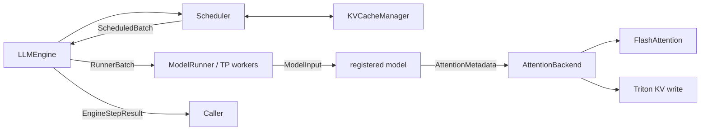

# Extensible runtime architecture

## Scope

Phase 1 reorganizes nano-vLLM around explicit ownership boundaries while
retaining the existing execution algorithms. It does not add a new GPU kernel,
AMD support, Mini-MoE, or a performance claim. GPU functional validation and
performance measurement are intentionally deferred to the next phase; the CPU
control plane is validated locally in this checkpoint.

The design follows one rule: scheduling describes **what work was admitted**;
the runner and backend decide **how that work becomes tensors and kernels**.

## Contracts and ownership

### Scheduling

`SequenceSchedule` freezes the selected `[token_start, token_end)` range for one
request. `ScheduledBatch` adds prefill/decode mode, admission budget, and IDs of
requests preempted during the decision. This removes the old implicit contract
where the scheduler mutated `Sequence.num_scheduled_tokens` and returned a
boolean that the runner had to interpret.

`Sequence` retains long-lived request state: tokens, status, sampling policy,
logical block table, and the committed cache frontier. Its block size is now an
instance field so multiple engines cannot change one another through a class
global. Worker serialization is handled by immutable runner snapshots instead of
custom, lossy `Sequence` pickle state.

### Logical KV cache

`KVCacheManager` is the scheduling-side protocol:

- `plan_allocation`: read-only admission plus prefix-hit discovery;
- `allocate`: materialize a previously accepted logical plan;
- `append_slot`: reserve a decode block when crossing a boundary;
- `commit`: publish fully computed blocks to the prefix cache;
- `free`: release references on completion or recompute preemption;
- `stats`: report capacity, usage, and prefix-cache entries.

`BlockManager` remains the default implementation. It still chains hashes over
full token blocks, verifies token contents after a hash hit, reference-counts
shared blocks, and retains inactive hashes until storage is reused. This layer
does not allocate GPU tensors.

### Runner protocol and model input

`RunnerBatch` is the device-agnostic, pickle-friendly protocol sent to tensor-
parallel workers. Each `RunnerSequenceInput` is an immutable snapshot containing
only the selected token slice, start/context positions, logical block table,
block size, and sampling temperature. Mutable `Sequence` objects remain on the
engine side. `ModelRunner` materializes these snapshots as a `ModelInput`
containing GPU input IDs, positions, and immutable `AttentionMetadata`; scheduler
policy and telemetry therefore do not leak into worker execution.

The runner still owns CUDA/NCCL initialization, model loading, physical KV tensor
allocation, CUDA Graph capture, tensor preparation, and sampling. Splitting those
responsibilities further is a later cross-device-runtime task; Phase 1 only makes
the model and attention dispatch replaceable.

### Scoped forward metadata

Attention and the LM head require per-batch tensors deep in the model hierarchy.
`forward_context()` installs validated metadata in a `ContextVar` for exactly one
forward or graph-capture scope and always restores the previous value. This keeps
the existing compact model signatures and CUDA Graph shape while avoiding an
unbounded mutable singleton.

The context remains an implicit dependency. Explicitly passing metadata through
every model layer is a valid future alternative if compiler/capture behavior and
model ergonomics justify the wider signature.

### Model and kernel dispatch

The model registry resolves Hugging Face `architectures` and `model_type` values
to factories. `ModelBuildContext` supplies runtime-owned build choices without
mutating the third-party Hugging Face config. Qwen3 is the only implementation
today. A Mini-MoE entry can later
be registered without changing runner construction, but MoE routing and kernels
do not exist in Phase 1.

`AttentionBackend` owns exactly three operations with distinct optimization
profiles: variable-length prefill, paged decode, and KV-cache write. A configured
backend name flows from `Config` into model construction. The default factory
creates one runner-local backend instance shared by the model's attention layers
and preserves the upstream
FlashAttention plus Triton path.

## State transitions and commit order

1. The scheduler plans and allocates logical blocks.
2. It emits immutable token ranges; a complete prefill request moves to running.
3. The runner computes and samples one token per scheduled sequence.
4. Postprocessing commits newly completed blocks, advances the committed cache
   frontier, and skips token append for an unfinished chunked prefill.
5. Once prefill is complete, or for every decode step, the sampled token is
   appended. Completion releases logical cache references.
6. If decode cannot reserve a boundary block, lower-priority running sequences
   are preempted, freed, returned to waiting, and later recomputed.

The scheduler remains synchronous. There is no rollback transaction if model
execution fails after logical allocation; fault recovery is outside this phase.

## Extension roadmap

### Phase 2: NVIDIA and AMD kernel work

- Introduce a device-runtime boundary for CUDA/HIP device selection, NCCL/RCCL,
  memory queries, synchronization, and graph capabilities.
- Implement one concrete alternate backend kernel, preferably paged decode or a
  fused RoPE/QK-normalization/KV-write path.
- Keep the default backend as the parity baseline; validate dtype, head shape,
  GQA ratio, context length, block-table fragmentation, and graph/eager paths.
- Add reproducible microbenchmarks and end-to-end TTFT, TPOT, throughput, cache
  utilization, and scheduler-overhead measurements on named GPUs.

### Phase 3: Mini-MoE

- Add a registered MoE model with router output as explicit execution metadata.
- Implement top-k routing, capacity/drop policy, token permutation and inverse
  permutation, then grouped GEMM through a narrow expert backend.
- Measure routing overhead, expert imbalance, padded versus grouped execution,
  and—only if multi-GPU is added—expert communication.

## Validation invariants

The local CPU suite now encodes these control-plane invariants:

- scheduled token ranges are positive, in bounds, and within the batch budget;
- decode schedules exactly one token per sequence;
- allocation planning has no side effects and plans cannot cross block sizes;
- used/free block counts and refcounts remain consistent through sharing, finish,
  and preemption;
- only full committed blocks enter the prefix index;
- chunked prefill never appends an intermediate sampled token;
- tensor-parallel `RunnerBatch` has immutable, pickle-stable value semantics.

The following GPU invariants remain for server-side validation:

- eager and CUDA Graph outputs match;
- all tensor-parallel ranks execute the same serialized `RunnerBatch`;
- default-backend output matches the upstream commit before measuring speed.

## Local validation environment

The default uv environment is deliberately CPU-only and includes the minimal
runtime-control dependencies plus pytest. `torch`, `transformers`, Triton, and
FlashAttention are optional inference/GPU dependencies, so importing Scheduler
does not initialize or require a GPU stack.

The local suite covers scheduling and logical cache invariants. Passing it does
not establish model-output parity, CUDA Graph correctness, CUDA/ROCm kernel
compatibility, or GPU performance; those require the later server-side matrix.
