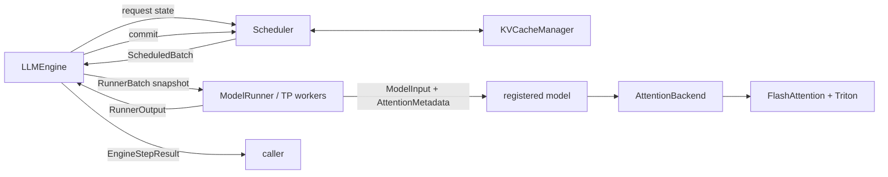

# Phase 1 checkpoint: extensible runtime foundation

## Status

Phase 1 is ready to be kept as a local Git checkpoint. The macOS/CPU control
plane has deterministic tests and a reproducible `uv` environment. The CUDA
execution path has been reviewed statically, but NVIDIA execution, tensor
parallelism, CUDA Graph replay, numerical parity, ROCm support, and performance
remain explicitly unverified.

This checkpoint is based on upstream commit `bb823b3` and lives on
`feat/extensible-runtime-phase1`. Its purpose is to establish stable runtime
boundaries before adding or tuning GPU kernels.

## What changed

### Explicit scheduling and execution contracts

- `ExecutionMode`, `SequenceSchedule`, and `ScheduledBatch` describe the exact
  prefill/decode work admitted in one step.
- `RunnerBatch` copies that decision into immutable, pickle-friendly worker
  snapshots instead of transferring mutable `Sequence` objects.
- `RunnerOutput` identifies sampled tokens by request ID, and the scheduler
  validates the complete result before advancing the committed cache frontier.
- `EngineStepResult` exposes completed requests, scheduled-token count,
  preemptions, and logical KV-cache statistics.

### Logical KV-cache lifecycle

- `KVCacheManager` separates scheduling policy from logical block ownership.
- `AllocationPlan` makes admission and prefix-hit discovery read-only before
  allocation.
- `BlockManager` remains the default implementation and preserves chained
  prefix hashes, token verification, reference-counted sharing, block rollover,
  full-block commit, completion cleanup, and recompute preemption.
- `Sequence.block_size` is per instance; the previous process-global class value
  and lossy custom pickle state were removed.

### Model and kernel extension points

- The runner constructs models through a model registry and
  `ModelBuildContext`; Qwen3 is still the only built-in model.
- `AttentionBackend` isolates variable-length prefill, paged decode, and
  KV-cache writes.
- The default backend preserves the original FlashAttention calls and Triton
  KV-cache-write kernel. No new GPU kernel or speedup is claimed in Phase 1.
- `AttentionMetadata` now has a validated, exception-safe `ContextVar` scope for
  one forward or CUDA Graph capture operation.

### Local development environment

- `.python-version` selects Python 3.12 and `uv.lock` records the resolved
  dependency graph.
- A default `uv sync` installs only CPU control-plane and test dependencies.
- Framework/model packages and the Linux NVIDIA stack are separated into the
  `inference` and `nvidia` extras.
- Package and configuration imports defer optional GPU/model dependencies so
  scheduler and logical-cache tests run on macOS without PyTorch, Transformers,
  Triton, or FlashAttention.

## Request-to-kernel flow



The scheduler owns *what runs* and logical cache state. The runner owns tensor
materialization and physical GPU memory. The model/backend boundary owns *which
kernels run*.

## Review and local evidence

Review covered scheduling state transitions, prefix sharing and refcounts,
chunked prefill, block-boundary decode, preemption ordering, worker snapshots,
shared-memory dispatch, scoped attention metadata, backend/model construction,
CUDA Graph interaction, optional imports, and documentation claims.

The tests found and fixed a real decode queue-restoration error during Phase 1:
the implementation attempted to reverse a generator instead of restoring the
scheduled sequence order correctly. No remaining high-priority issue was found
in the locally executable control-plane scope.

Reproduction on macOS:

```bash
uv --cache-dir /private/tmp/nanovllm-uv-cache sync --locked
uv --cache-dir /private/tmp/nanovllm-uv-cache run --locked pytest
uv --cache-dir /private/tmp/nanovllm-uv-cache run --locked pytest \
  --cov=nanovllm.engine.block_manager \
  --cov=nanovllm.engine.contracts \
  --cov=nanovllm.engine.scheduler \
  --cov=nanovllm.engine.sequence \
  --cov-report=term-missing
git diff --check
```

Recorded result for this checkpoint:

- Python 3.12.13 and uv 0.10.9;
- 27 tests passed;
- 91% statement coverage across the four control-plane modules above;
- default `.venv` contains no PyTorch, Transformers, Triton, or FlashAttention;
- `git diff --check` passes.

## Validation boundary

| Area | Checkpoint status |
| --- | --- |
| Scheduling contracts and validation | Tested locally |
| Logical KV allocation, prefix reuse, refcounts, commit/free | Tested locally |
| Chunked prefill, decode rollover, recompute preemption, EOS | Tested locally |
| Immutable worker snapshot and pickle round trip | Tested locally |
| Optional-import isolation and CPU-only environment | Tested locally |
| Qwen model-output parity with `bb823b3` | Pending NVIDIA GPU |
| FlashAttention/Triton eager execution | Pending NVIDIA GPU |
| CUDA Graph capture/replay parity | Pending NVIDIA GPU |
| Tensor-parallel shared-memory/NCCL execution | Pending multi-GPU test |
| GPU performance and memory measurements | Pending benchmark |
| ROCm execution and AMD kernels | Not implemented |
| Mini-MoE model, routing, and grouped GEMM | Not implemented |

This table is the historical boundary of the Phase 1 checkpoint. Later
teaching branches add contiguous-prefill Triton FlashAttention and Mini-MoE
Triton dispatch/grouped GEMM; see `teaching-flash-attention.md` and
`teaching-mini-moe.md` for their current validation status.

Two review caveats should remain visible:

1. Runtime registry mutations are process-local. A custom model/backend used with
   spawned tensor-parallel workers must be imported and registered in every
   worker, or be added as a built-in registration.
2. `uv sync --extra nvidia` is a starting point, not a validated GPU image. The
   target server still needs a pinned and tested Python/PyTorch/CUDA/
   FlashAttention/Triton matrix.

## Phase 2 entry plan

1. Reproduce `bb823b3` and this checkpoint in the same NVIDIA container.
2. Check token/logit parity in eager mode, then eager versus CUDA Graph parity.
3. Exercise tensor parallelism and the serialized `RunnerBatch` protocol.
4. Record a baseline for TTFT, TPOT, throughput, memory, cache utilization, and
   scheduler time.
5. Add one concrete Triton/CUDA backend operation and compare it against the
   unchanged default backend.
6. Only after the NVIDIA path is stable, introduce a device-runtime boundary and
   a ROCm-compatible backend; Mini-MoE can follow through the model registry.
