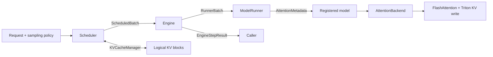

# Phase 1: resume narrative and interview defense

This document describes how to present the Phase 1 refactor accurately. It is
not a performance report. Runtime correctness and performance must be measured
in a later validation phase before any quantitative claim is put on a resume.
The “not implemented” statements below describe that historical Phase 1 commit;
later teaching branches add candidate Triton FlashAttention and Mini-MoE
kernels, whose NVIDIA validation remains pending.

## Project positioning

The original nano-vLLM is a compact educational inference runtime with useful
features already implemented: paged KV-cache blocks, prefix caching, chunked
prefill, preemption, tensor parallelism, FlashAttention, a Triton KV-cache write
kernel, and CUDA Graph decode. The Phase 1 contribution is therefore not to
claim those upstream features as new work.

The contribution is to turn their implicit, tightly coupled control flow into
an explicit runtime architecture that can accept later kernel, device, and model
work without rewriting the scheduler. In one sentence:

> Refactored a compact, CUDA-specific LLM inference prototype into a
> contract-driven runtime with explicit scheduling, KV-cache, execution, model,
> and attention-backend boundaries.

This is primarily an **inference-runtime architecture** project at Phase 1. It
becomes a stronger GPU systems project only after Phase 2 adds real kernels,
cross-device execution, and measured results.

## What Phase 1 actually implements

The code should be explained as five connected decisions:

1. **Scheduling decisions are values, not side-channel state.**
   `ExecutionMode`, `SequenceSchedule`, and `ScheduledBatch` describe the exact
   token range selected for each sequence, the batch budget, and preemptions.
   This replaces the ambiguous `(sequences, is_prefill)` convention.

2. **The scheduler depends on a logical KV-cache lifecycle.**
   `KVCacheManager`, `AllocationPlan`, and `KVCacheStats` make allocation,
   append, commit, free, and observability explicit. `BlockManager` remains the
   default implementation and retains prefix-cache/reference-count policy.

3. **The runner consumes a stable execution contract.**
   `RunnerBatch` carries immutable `RunnerSequenceInput` snapshots to tensor-
   parallel worker processes. It contains only the selected tokens, positions,
   context length, block table, and sampling temperature. Scheduling policy and
   mutable request state stay on the engine side; tensor materialization stays
   inside `ModelRunner`.
   The worker returns a small `RunnerOutput` keyed by request ID; the scheduler
   validates the whole response before committing cache/request state.

4. **Attention metadata has a bounded lifetime.**
   Immutable `AttentionMetadata` and `forward_context()` replace a mutable
   process-global singleton. The metadata is installed only around one model
   forward or CUDA Graph capture scope and is reset even if execution raises.

5. **Models and attention kernels have explicit extension points.**
   The model registry removes direct Qwen construction from the runner. The
   attention backend owns prefill attention, decode attention, and KV-cache
   writes. The default backend preserves the existing FlashAttention plus
   Triton path.

## Scope boundaries: claims that are not yet valid

Do not currently claim any of the following:

- AMD or ROCm support. Device setup still uses CUDA, NCCL, and CUDA Graph APIs.
- A new attention implementation. The default path still calls FlashAttention.
- A faster runtime. Phase 1 deliberately has no benchmark evidence.
- Production serving. There is no online API, admission-control service, fault
  recovery, request cancellation, or multi-tenant isolation.
- Mini-MoE support. The model registry is only an entry point; routing, token
  permutation, grouped GEMM, and expert communication do not exist yet.
- End-to-end model or GPU runtime correctness after the refactor. The CPU
  control plane now has local tests, but model execution, CUDA Graph, TP, and
  kernel parity remain unvalidated.

It is accurate to say that Phase 1 **creates seams for** these later features.
It is not accurate to say it implements them.

## Resume bullets

Use the Phase 1-only version only after functional validation is complete. Do
not add invented percentages.

### English, Phase 1 only

- Refactored a roughly 1.5K-line nano-vLLM inference engine into a
  contract-driven architecture, replacing tuple/boolean control flow with typed
  prefill/decode schedules, explicit token ranges, structured engine results,
  and observable preemption/KV-cache state.
- Separated scheduler policy from paged KV-cache lifecycle through allocation,
  commit, append, and free interfaces while retaining prefix reuse, chunked
  prefill, and recompute-based preemption in the default implementation.
- Introduced scoped attention metadata plus pluggable model and attention
  backends, preserving the FlashAttention/Triton execution path while preparing
  the runtime for independently developed CUDA/ROCm kernels and MoE models.

### 中文，Phase 1 only

- 将约 1.5K 行的 nano-vLLM 教学型推理引擎重构为契约驱动架构，以显式的
  prefill/decode 执行计划、token 区间和结构化 step 结果替代 tuple/boolean
  隐式协议，并暴露抢占与 KV-cache 状态。
- 解耦调度策略和 paged KV-cache 生命周期，抽象 allocation、append、commit
  与 free 边界，同时在默认实现中保留 prefix cache、chunked prefill 和
  recompute preemption 语义。
- 引入作用域化 attention metadata、模型注册表和可插拔 attention backend，
  保留 FlashAttention + Triton 默认路径，为后续 CUDA/ROCm 算子及 MoE 模型
  接入建立稳定边界。

### After Phase 2 has real measurements

Replace brackets only with reproducible results from the benchmark scripts and
record the GPU, dtype, shapes, model, batch/concurrency, and baseline commit.

- Implemented `[kernel name]` for CUDA and ROCm through the runtime's attention
  backend, achieving `[x]x` kernel speedup / `[y]%` lower decode latency on
  `[NVIDIA GPU]` and `[AMD GPU]` versus `[precise baseline]`, with output error
  bounded by `[tolerance]`.
- Characterized TTFT, TPOT, throughput, and KV-cache utilization across
  `[workload range]`; identified `[bottleneck]` using Nsight Systems/Compute and
  rocprof, then improved `[metric]` by `[measured result]`.

### After Phase 3 has Mini-MoE

- Added top-k expert routing, token permutation/unpermutation, and grouped GEMM
  execution for a Mini-MoE model; measured expert-load imbalance, routing
  overhead, and throughput across `[token/expert configurations]`.

## Thirty-second explanation

> nano-vLLM already had several optimizations, but its scheduler, mutable
> sequence state, KV-cache policy, runner, and CUDA attention path communicated
> through implicit booleans and global metadata. I first made the execution plan
> explicit: the scheduler emits immutable per-sequence token ranges, the runner
> materializes tensors from that plan, and attention consumes scoped metadata. I
> also separated logical KV-cache management from physical cache kernels and
> added model/backend registries. This Phase 1 does not claim a speedup; it makes
> the next CUDA/ROCm kernel and Mini-MoE work independently implementable and
> measurable.

## Two-minute technical walkthrough

Start at `LLMEngine.step()`, not at individual dataclasses:

1. `Scheduler.schedule()` chooses prefill or decode work under sequence and token
   budgets. Each `SequenceSchedule` records `token_start` and `token_count`; the
   runner no longer infers this decision from mutable counters.
2. The scheduler requests logical blocks through `KVCacheManager`. Admission
   planning can account for prefix hits before mutating allocation state. A
   commit occurs only after the scheduled work returns.
3. `LLMEngine` converts the decision to immutable `RunnerSequenceInput`
   snapshots inside a `RunnerBatch`, suitable for the existing shared-memory/
   pickle tensor-parallel control path without exposing mutable scheduler state.
4. `ModelRunner` creates GPU tensors and an `AttentionMetadata` object. A scoped
   context supplies metadata to attention layers without threading the same long
   parameter list through every decoder layer.
5. The registered Qwen model delegates prefill, decode, and cache writes to the
   configured backend. Today that backend invokes the original FlashAttention
   functions and Triton store kernel.
6. The engine returns an `EngineStepResult`, including completed outputs, mode,
   scheduled-token count, preempted IDs, and cache statistics. These fields are
   the basis for later serving telemetry and benchmark attribution.

End with the boundary: Phase 1 improves ownership and interfaces, not measured
GPU performance.

## Likely interview questions

### Why was a refactor necessary?

The old `(sequences, is_prefill)` return type omitted the token range and budget,
while the runner reconstructed them from mutable `Sequence` fields. Attention
read a mutable global context, and `ModelRunner` directly constructed Qwen and
called CUDA-specific components. A new backend or model would therefore require
changes across scheduling, execution, and layer code. The refactor assigns each
decision to one owner and makes cross-component data explicit.

### Is this just adding dataclasses?

No. The important change is state ownership and commit order. The scheduler owns
policy, the cache manager owns logical block lifecycle, the runner owns tensor
materialization, and the backend owns kernel dispatch. The dataclasses make that
separation enforceable and inspectable; they are the mechanism, not the result.

### Why is `SequenceSchedule` immutable if it references a mutable `Sequence`?

The scheduling **decision**—mode and token range—must not change after admission.
The referenced sequence remains the engine's evolving request state, but it does
not cross the worker boundary: `RunnerBatch.from_schedule()` copies the exact
selected token slice plus immutable execution metadata into
`RunnerSequenceInput`. Postprocessing still uses the authoritative engine-side
sequence. This separates policy ownership from execution without copying the
entire prompt for decode.

### Why have both `ScheduledBatch` and `RunnerBatch`?

`ScheduledBatch` includes scheduler-facing information such as the token budget,
preempted request IDs, and authoritative sequence references. Workers only need
mode and immutable execution snapshots.
`RunnerBatch` prevents scheduler policy and telemetry from becoming part of the
worker protocol and gives that protocol a place to evolve independently.

### Why use `ContextVar` rather than passing metadata as a model argument?

Passing metadata explicitly is the purest API, but it would modify every model,
decoder layer, and attention call and can complicate compiled/captured call
signatures. A scoped context keeps model signatures compact while fixing the
original singleton's unbounded lifetime and exception-safety problem. It is
process-local, nesting-safe, and reset automatically. The tradeoff is an implicit
dependency at the attention layer, which should be documented and validated with
CUDA Graph capture.

### How are logical and physical KV caches different?

The logical cache maps sequence blocks to block IDs, tracks refcounts, prefix
hashes, admission, and reclamation. It does not own GPU tensors. The physical
cache is allocated by the runner and attached to attention layers; the backend
writes K/V tensors into slots selected by the logical block table. Keeping these
separate lets scheduling policy be tested without a GPU and lets cache kernels
change without rewriting admission policy.

### How does prefix caching work?

Full token blocks are chained by hashes. Admission walks a sequence's prefix,
verifies both the hash and token contents, and reuses matching blocks. Refcounts
allow an active cached block to be shared. New complete blocks are hashed during
commit; freeing drops references while retained hashes can make inactive blocks
eligible for later reuse until their storage is reassigned.

### What preemption policy is implemented?

Decode requires a free block when a sequence crosses a block boundary. If none
is available, the scheduler preempts lower-priority running work from the tail,
frees its logical blocks, returns it to the front of the waiting queue, and later
recomputes its state. There is no CPU swap or cost-aware priority policy yet.
The structured preempted IDs make this behavior measurable in a later phase.

### Does the backend abstraction already make it ROCm-compatible?

No. It isolates attention dispatch, which is necessary but not sufficient. The
runtime still initializes NCCL, selects `torch.cuda` devices, allocates CUDA
graphs, and imports CUDA-oriented dependencies. Real ROCm support needs a device
runtime abstraction, RCCL-compatible distributed setup, supported attention and
cache kernels, dependency packaging, and results on AMD hardware.

### Why isolate three backend operations?

Prefill attention, paged decode attention, and KV-cache writes have different
shapes, memory behavior, and optimization strategies. Treating them separately
allows a project to replace one kernel and compare it against the default path
without claiming an entirely new attention stack. It also exposes fusion
opportunities around cache writes without coupling them to scheduler code.

### Is one concrete backend overengineering?

It would be if there were no planned second consumer. Here Phase 2 explicitly
targets alternative CUDA/ROCm kernels, and the seam follows an existing natural
boundary: three calls that were directly embedded in `Attention`. The interface
is intentionally narrow; it does not introduce a general plugin framework or
abstract every tensor operation. Its value must still be demonstrated by adding
the second backend.

### Why add a model registry?

Direct Qwen construction made model selection a runner responsibility. The
registry maps Hugging Face architecture names to factories, so dense Qwen remains
the default while a later Mini-MoE model can be introduced without changing
runner initialization. The registry alone is not MoE support: execution still
needs router outputs, permutation, grouped GEMM, load balancing, and potentially
expert-parallel communication.

### What overhead does the architecture add?

It adds small Python objects during scheduling and context installation. Those
operations occur once per engine step, outside the inner GPU kernels, but their
cost is not assumed negligible. Later benchmarks must measure scheduler time and
end-to-end latency, especially for small decode batches where Python overhead is
more visible. Frozen contracts can also create short-lived allocations; pooling
is only justified if profiling identifies them as material.

### How did you prove behavior was preserved?

The CPU control plane now has deterministic tests for allocation planning,
prefix reuse/refcounts, full-block commit, chunked prefill, decode rollover,
recompute preemption, completion, immutable worker snapshots, and batch
validation. Those tests found and fixed a decode queue restoration bug. They do
not prove model or GPU behavior: model-output parity, multi-process checks,
eager/CUDA Graph parity, backend kernels, and benchmarks still require a GPU
validation phase.

### Why work on nano-vLLM instead of modifying vLLM directly?

The compact codebase makes the complete request-to-kernel path understandable
and allows architectural decisions to be defended end to end. Production vLLM
would provide greater realism but much more integration surface. The value of
this project is depth and measured extensions, not claiming production parity.
Once the concepts are validated here, comparing them with equivalent vLLM
interfaces is a useful follow-up.

## Phase 2 recommendation for AMD/NVIDIA roles

The strongest continuation is one end-to-end kernel project rather than several
half-implemented optimizations:

1. Add a second attention backend with one real kernel, preferably a paged-decode
   attention kernel or a fused RoPE/QK-normalization/KV-write path.
2. Keep the default backend as the correctness baseline and dispatch the new
   backend through the Phase 1 contract.
3. Test numerical error across dtypes, head dimensions, sequence lengths, batch
   sizes, GQA ratios, and non-contiguous block tables.
4. Benchmark on one NVIDIA and one AMD GPU if hardware is available. Report exact
   software versions; a portable Triton source is not proof of equal performance
   or even of support on both installations.
5. Profile memory transactions, occupancy, launch count, and synchronization with
   Nsight and rocprof. Explain why performance changes instead of reporting only
   a speedup number.
6. Connect the microbenchmark to TTFT, TPOT, throughput, and memory usage in the
   full runtime. A fast isolated kernel that does not improve end-to-end decode is
   still an informative result if the bottleneck is explained.

For internship screening, this produces a coherent story: Phase 1 shows runtime
architecture, Phase 2 shows GPU/kernel depth and measurement discipline.

## Phase 3 Mini-MoE roadmap

Mini-MoE should extend the same architecture rather than become a disconnected
demo:

- Register a small MoE model architecture through the model registry.
- Define router output and expert-execution metadata explicitly.
- Implement top-k selection and deterministic token-to-expert assignment.
- Implement permutation/unpermutation and a grouped-GEMM execution path.
- Measure expert load imbalance, padding/capacity loss, routing overhead, and
  grouped-GEMM utilization across token counts and expert distributions.
- Add expert parallelism only after the single-device data movement is understood;
  otherwise communication will hide the kernel behavior the project is intended
  to demonstrate.

The natural interview theme is that dense inference schedules requests, whereas
MoE adds a second dynamic scheduling problem inside each layer: routing tokens to
experts. Phase 1's model and execution boundaries help, but new expert contracts
are still required.

## Validation evidence to collect later

### Correctness

- Unit tests for allocation plans, refcounts, prefix hits/collisions, block
  rollover, commit/free ordering, and out-of-memory admission.
- Scheduler traces for chunked prefill, mixed queue states, decode preemption, EOS,
  and maximum-token termination.
- Token/logit parity against the baseline commit in eager mode.
- Eager versus CUDA Graph parity for multiple decode batch sizes.
- Tensor-parallel parity and worker serialization checks.
- Backend contract/error tests and model registry selection tests.

### Performance

- Scheduler CPU time per step and allocations per step.
- Prefill throughput, decode throughput, TTFT, TPOT, and p50/p95 latency.
- KV-cache utilization, prefix-hit rate, and preemptions/recomputed tokens.
- Kernel latency across a declared shape matrix, plus numerical tolerance.
- End-to-end comparison with the original commit and a clearly versioned external
  baseline; never reuse upstream README numbers as results for this branch.

## Code-review tour

Use this order in an interview or repository README:

1. `nanovllm/engine/contracts.py` — the control-plane vocabulary.
2. `nanovllm/engine/scheduler.py` — production of token-range schedules.
3. `nanovllm/engine/kv_cache.py` and `block_manager.py` — logical cache policy.
4. `nanovllm/engine/model_input.py` and `model_runner.py` — execution-plan
   materialization.
5. `nanovllm/utils/context.py` — scoped data-plane metadata.
6. `nanovllm/layers/backends.py`, `flash_attention_backend.py`, and
   `attention.py` — lazy kernel registry, default implementation, and dispatch.
7. `nanovllm/models/registry.py` — model-family extension point.
8. `nanovllm/engine/llm_engine.py` — structured result and observability.

This order demonstrates a complete request-to-kernel path and prevents the
presentation from sounding like a list of unrelated abstractions.
