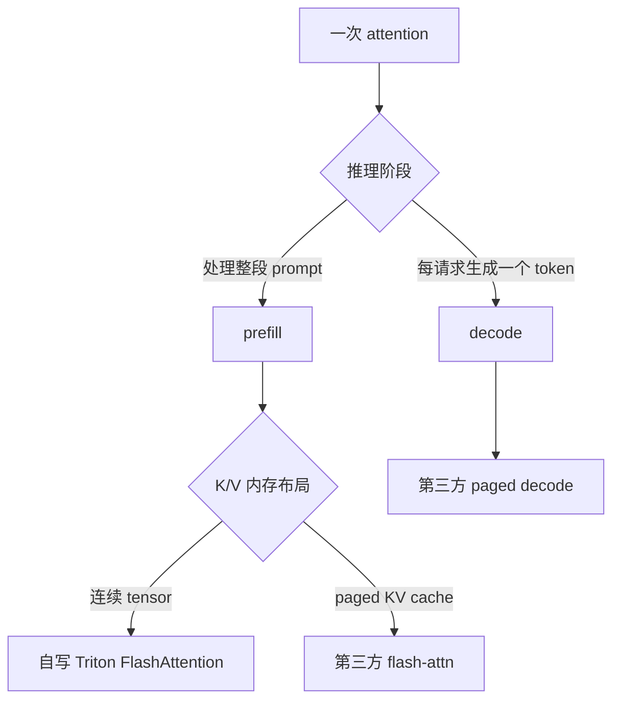

# 当前 GPU 算子逐一讲解（初学者版）

本文对应当前源码，而不是一份未来设计。项目自己写了 9 个 Triton
kernel：一个 KV-cache 写入、一个连续 prefill FlashAttention，以及七个
Mini-MoE kernel。paged prefill 和 paged decode 仍调用第三方 `flash-attn`
CUDA 扩展，不是本项目手写的 Triton 或 CUDA kernel。

## 1. 先把三个维度分开



- **prefill/decode** 描述推理处于哪个阶段。
- **contiguous/paged** 描述 K/V 在显存中怎样摆放。
- **Triton/CUDA** 描述 kernel 用什么技术实现。

所以“Triton 连续 prefill”和“paged prefill/decode”不是同一个意思。一个
kernel 可以同时是 Flash-style 和 paged，但当前自写 FlashAttention 只支持
连续 K/V。这里说的“其他 GPU 路径”是仍在 GPU 上执行、但调用外部
`flash-attn` CUDA 扩展的分支，不是 CPU fallback。

## 2. 阅读 Triton 前要懂的最小词汇

- **算子（operator）**：用户看到的 tensor 操作，例如 attention 或 MoE。
  一个算子内部可能启动多个 kernel。
- **kernel**：在 GPU 上并行执行的函数。
- **grid**：一次 kernel launch 启动的全部 Triton program。
- **program**：处理一个 tile 的实例，大致可类比 CUDA thread block；它
  不是一个 Python 线程。
- **tile**：把大矩阵切成的小矩形。例如 `BLOCK_M=16, BLOCK_N=32` 表示
  一个 program 负责一个 $16\times32$ 输出块。
- **warp**：NVIDIA 上同步执行的一组 32 个线程。`num_warps=4` 通常表示
  一个 program 使用 128 个线程。
- **pointer**：显存地址；**stride** 是某一维索引增加 1 时地址移动多少个
  元素。
- **mask**：边界布尔条件。tile 通常是固定大小，最后一块不满时必须用
  mask 阻止越界读写。
- **HBM/global memory**：容量大的显存，访问代价高；寄存器/共享内存更快
  但小得多。
- **coalesced access**：相邻 lane 访问相邻地址，让显存事务更有效率。
- **reduction**：把多个数合成较少的数，例如求和或最大值。
- **FP16/BF16**：16 位输入格式；kernel 常用 FP32 累加以减小误差。
- **JIT**：Triton 在首次遇到一组 dtype/shape/常量配置时即时编译 kernel。
- **`num_stages`**：软件流水线阶段数，帮助重叠数据加载和计算；越大不
  一定越快，还可能增加寄存器或共享内存压力。
- **Tensor Core**：GPU 中专门做小块矩阵乘加的硬件；`tl.dot` 给编译器
  使用它的机会，但是否高效必须 profile。

## 3. KV-cache 写入 kernel

源码：`nanovllm/layers/flash_attention_backend.py` 中的
`store_kv_cache_kernel`。

输入是本轮新产生的 `key/value`，目标是预分配好的 `key_cache/value_cache`，
`slot_mapping[token]` 告诉它每个 token 应写到哪个物理槽位。grid 是
`(num_tokens,)`，即一个 program 负责一个 token。

逐步看：

1. `tl.program_id(0)` 得到 token 编号。
2. 从 `slot_mapping` 读物理 slot；`-1` 代表 CUDA Graph 的填充行，不写。
3. `tl.arange(0, width)` 枚举该 token 的全部
   `num_kv_heads * head_dim` 特征。
4. 依据源 tensor 的 stride 加载 K 和 V。
5. 用 `slot * width + offset` 算目标地址并写入 cache。

这叫 **scatter（散写）**：输入按 batch 顺序排列，输出地址却由映射表
决定。它只负责存数据，不负责算 attention；prefill 和 decode 都可能先
调用它。

## 4. 连续 prefill FlashAttention kernel

源码：`nanovllm/layers/triton_flash_attention.py` 中的
`_flash_attention_forward_kernel`。

输入布局是 `[packed_tokens, heads, head_dim]`。不同长度的序列首尾相接，
`cu_seqlens_q/k` 是累计长度数组，例如长度 `[3, 5]` 对应 `[0, 3, 8]`。
grid 为：

```text
(query tile, query head, sequence)
```

一个 program 因而负责“一条序列、一个 Q head、最多 `BLOCK_M` 个 query”。

普通 attention 概念上计算：

$$
S=QK^{\mathsf T},\qquad P=\operatorname{softmax}(S),\qquad O=PV.
$$

若把完整 $N\times N$ 分数矩阵写到 HBM，读写量很大。FlashAttention 的
核心不是改变答案，而是按 `BLOCK_N` 分块流过 K/V，并在寄存器中维护：

- 当前最大值 $m$；
- softmax 分母 $l$；
- 未归一化输出 $o$。

读入新分数块 $S_j$ 后：

$$
m'=\max(m,\operatorname{rowmax}(S_j)),
$$

$$
l'=e^{m-m'}l+\sum e^{S_j-m'},
$$

$$
o'=e^{m-m'}o+e^{S_j-m'}V_j.
$$

最后写 $O=o/l$。这叫 **online softmax**：无需同时保存全部分数，也能
得到与完整 softmax 相同的数学结果。减去最大值可避免指数溢出。源码用
`exp2`，所以缩放量还乘了 $\log_2 e$。

其他关键点：

- **causal mask** 禁止 query 看到未来 key。
- **GQA**（Grouped-Query Attention）让多个 Q head 共用一个 KV head；
  `q_head // (Hq/Hkv)` 完成映射。这里的 grouped 与 grouped GEMM 无关。
- **chunked prefill** 中 Q 可能只是完整上下文的后缀，所以绝对位置是
  `key_length - query_length + local_query_position`。
- `tl.dot(Q_tile, K_tile.T)` 和 `tl.dot(P_tile, V_tile)` 是两次 tile 矩阵乘。
- FP32 保存 softmax 状态和输出累加，最后转回 FP16/BF16。
- 这是 forward-only、causal、head dimension 不超过 128 的教学实现。

## 5. Mini-MoE 到底在算什么

**MoE（Mixture of Experts）** 把普通 Transformer 的一个 MLP 换成多个
MLP expert。router 为每个 token 打分并只选择 top-$k$ 个：

$$
r=W_rx,\qquad y=\sum_{i=1}^{k}g_iE_{e_i}(x).
$$

`expert ID` 是 $e_i$，归一化 gate 权重是 $g_i$。一个 token 选两个 expert
就产生两个 **assignment（派发项）**。Qwen expert 是 SwiGLU：

$$
E(x)=W_{down}[\operatorname{SiLU}(W_{gate}x)\odot W_{up}x],
$$

其中 $\operatorname{SiLU}(z)=z\sigma(z)$，$\odot$ 表示逐元素乘法。

当前有三种模式：

| 模式 | 做法 | 用途 |
| --- | --- | --- |
| `dense_masked` | 所有 token 跑所有 expert，再 mask | 静态、易理解但不省计算 |
| `sparse_reference` | Python 逐 expert gather/GEMM/index-add | 正确性参考 |
| `sparse_dispatch` | Triton 重排 + grouped GEMM + 恢复 | 自定义稀疏路径 |

`triton_grouped` 是第三种模式的别名。

## 6. Mini-MoE kernel A：expert histogram

`_count_expert_assignments_kernel` 每次读取一批 expert ID，并对
`count[expert_id]` 做 `tl.atomic_add(..., 1)`。**histogram（直方图）** 在这里
就是统计每个 expert 收到多少 assignment。

为什么要 atomic？多个 GPU program 可能同时给同一个 expert 加一。普通的
“读、加、写”会互相覆盖；**原子操作**保证整个修改不可被另一修改插入。

## 7. kernel B：exclusive prefix sum

`_exclusive_prefix_sum_kernel` 把：

```text
counts  = [2, 3, 3, 0]
offsets = [0, 2, 5, 8, 8]
```

`prefix sum/scan` 是累计和；**exclusive** 表示当前位置不包含自己。因此
expert $e$ 拥有 `offsets[e]:offsets[e+1]`，空 expert 的区间长度自然为零。
专家数限制在 64，所以一个 program 就能完成这个小 scan。

## 8. kernel C/D：reserve destination 与 gather

`_assign_expert_rows_kernel` 给每个 expert 准备一个 atomic cursor。每个
assignment 原子地领取该 expert 区间内的一行，并记录：

```text
inverse_permutation[原 assignment] = 重排后的行号
```

`_gather_permuted_tokens_kernel` 再把对应 token hidden row 复制到这个行号。
一个 token 被 top-$k$ 选中几次，它就会被复制几次。结果变为：

```text
[expert 0 的行][expert 1 的行]...[expert E-1 的行]
```

**permutation** 是重排；**gather** 是按索引读取并汇集。atomic 导致同一
expert 内部的行顺序不固定，但 inverse mapping 记录了每项去哪里，所以
最终结果不依赖这个顺序。所有 launch 在同一 CUDA stream 中按序可见，
无需把 offsets 拷回 CPU。

## 9. kernel E：grouped gate/up GEMM + fused SwiGLU

**GEMM** 是一般矩阵乘 $C=AB$。若 expert $e$ 收到 $M_e$ 行，它要算：

$$
G_e=X_eW_{gate,e}^{\mathsf T},\qquad
U_e=X_eW_{up,e}^{\mathsf T}.
$$

各 expert 的 $M_e$ 不相等，普通 batched GEMM 假设形状一致，不合适。
**grouped GEMM** 表示把这些不同 $M_e$ 的独立 GEMM 统一调度。

`_grouped_gate_up_swiglu_kernel` 的流程是：

1. 从全局 row-tile ID 和 `expert_offsets` 找到所属 expert 与局部 row tile。
2. 以 `BLOCK_M=16, BLOCK_N=32, BLOCK_K=32` 切块。
3. 沿 K/hidden 维反复加载输入和该 expert 的权重。
4. 用 `tl.dot` 分别累加 gate 与 up，累加器是 FP32。
5. 在同一个 kernel 里算 `SiLU(gate) * up` 后才写 HBM。

最后一步叫 **fusion（融合）**：若分成多个 kernel，就要把 gate、up 中间
结果多次写入并读回 HBM。融合减少 launch 和显存流量。

host 不把动态 expert counts 拷回 CPU，而是启动一个安全的 row-tile 上界。
多余 program 的 `selected=False`，其 load/store 全被 mask 掉。这样避免一次
host-device 同步，但可能有少量空 program；这是教学实现的取舍。

## 10. kernel F：grouped down GEMM

`_grouped_down_projection_kernel` 用相同调度方式计算：

$$
Y_e=A_eW_{down,e}^{\mathsf T}.
$$

它再次沿 K/intermediate 维做 tile reduction。输入、权重可以是 FP16 或
BF16，累加器是 FP32；M/N/K 尾块全部由 mask 保护。空 expert 没有有效
row tile，不会写输出。

## 11. kernel G：weighted unpermute

`_weighted_unpermute_kernel` 为每个原 token 和 feature tile 启动一个
program。它遍历该 token 的 top-$k$ slot，通过 `inverse_permutation` 找到
expert 输出，然后计算：

$$
y_t=\sum_{j=1}^{k}g_{t,j}Y_{\operatorname{dest}(t,j)}.
$$

**unpermute** 是恢复原 token 顺序。每个 program 独占一个 token 的输出，
因此 combine 不需要 atomic，top-$k$ 的加法顺序也固定。

## 12. 为什么保留 PyTorch reference

优化代码同时改变数据顺序、调度和精度，很难仅靠肉眼确认。
`sparse_reference` 故意使用清楚但较慢的 Python expert 循环，充当
**correctness oracle（正确性基准）**。GPU 测试比较：

- histogram、offset 和 permutation round trip；
- 空 expert 与非 tile 整数倍维度；
- FP16/BF16 输出误差；
- 完整 `MiniMoE` 与 reference 的 router ID、权重和输出；
- 非连续输入及非法 expert ID 的防护。

**parity** 指在规定误差内结果一致；它不等于性能更快。

## 13. 把源码里的 Triton 写法逐项对上

一个最小 Triton kernel 通常长这样：

```python
@triton.jit
def kernel(x_ptr, out_ptr, n, BLOCK: tl.constexpr):
    pid = tl.program_id(0)
    offsets = pid * BLOCK + tl.arange(0, BLOCK)
    mask = offsets < n
    x = tl.load(x_ptr + offsets, mask=mask, other=0.0)
    tl.store(out_ptr + offsets, x, mask=mask)
```

- `@triton.jit`：首次调用时编译，不是由 Python 解释器逐元素运行。
- `tl.constexpr`：编译期常量；编译器可据此确定 tile shape、展开循环并
  为不同配置生成不同 kernel。
- `tl.program_id(axis)`：当前 program 在 grid 某个轴上的坐标。
- `tl.arange`：产生 tile 内的一组向量化索引。
- `tl.load/tl.store`：从 GPU 内存读写；mask 为 false 的 lane 不访问地址。
- `other=0.0`：masked load 返回的填充值，矩阵乘尾块需要零填充。
- `tl.cdiv(a,b)`：向上取整除法，用来算 tile 个数。
- `tl.where`：逐元素选择，不是 Python 分支。
- `tl.cumsum/tl.sum/tl.max`：scan 或 reduction。
- `tl.dot`：tile 级矩阵乘加；源码显式使用 FP32 accumulator。

Python wrapper 负责检查 shape/dtype/device、分配输出、选择 tile 参数和
构造 grid；`kernel[grid](...)` 才是真正的 GPU launch。

## 14. 集成边界与未完成项

- 仅 inference forward，没有 autograd/backward。
- 仅单 GPU，`tensor_parallel_size=1`。**TP** 是把一个层分片到多 GPU。
- 没有 **expert parallelism**：不同 expert 分布在不同 GPU。
- 没有 **all-to-all**：多 GPU 互相交换路由 token 的通信。
- 没有 capacity limit、丢 token 策略、router 训练或负载均衡 loss。
- 稀疏路径当前只允许 eager；它每次 forward 分配动态 workspace，尚未接入
  CUDA Graph。
- expert 权重会惰性 stack 成连续缓存；参数正常原地更新会靠版本号失效，
  checkpoint 重载与 `diversify_experts_` 也会显式清缓存。
- 这是可读的第一版调度，不含 autotune、persistent scheduling、量化或
  针对特定 SM 架构的优化。

## 15. RTX 3060 上怎样验证

Mac 只能完成 Python、配置、源码和静态检查，无法证明 Triton 能在 NVIDIA
上 JIT，也无法证明数值或性能。WSL2/Linux NVIDIA 环境中先运行：

```bash
uv sync --locked --extra nvidia

uv run --locked --extra nvidia pytest -o addopts="-ra" -m gpu \
  tests/gpu/test_triton_moe.py

NANOVLLM_TEST_MODEL=~/models/Qwen3-0.6B \
NANOVLLM_TEST_MINI_MOE_MODEL=~/models/Qwen3-0.6B-mini-moe \
  uv run --locked --extra nvidia pytest -o addopts="-ra" -m gpu \
  tests/gpu/test_gpu_runtime.py -k mini_moe
```

通过后才做 warmup 和多次 benchmark，并用 Nsight Systems/Compute 查看
launch 开销、显存流量、occupancy、Tensor Core 利用率和 padding 浪费。
在这些证据出现前，只能说“实现并静态审查了 kernel”，不能说“已加速”。
