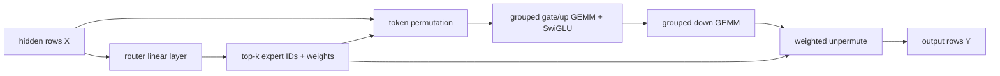

# Teaching implementation: Qwen3 Mini-MoE and Triton grouped GEMM

## 1. What Mini-MoE changes

A dense Transformer sends every token through one feed-forward network (MLP).
A mixture-of-experts (MoE) layer owns several MLPs called **experts**. A small
router selects only top-$k$ experts for each token:

$$
r=W_rx, \qquad (e_i,g_i)=\operatorname{TopKSoftmax}(r),
$$

$$
y=\sum_{i=1}^{k}g_iE_{e_i}(x).
$$

Here a **token** means one hidden-state row, $W_r$ is the router matrix, $e_i$
is an expert ID and $g_i$ is its normalized weight. Qwen's expert is a SwiGLU
MLP, where the gate and up projections are multiplied element by element:

$$
E(x)=W_{down}[\operatorname{SiLU}(W_{gate}x)\odot W_{up}x].
$$

`SiLU(z)=z\,\sigma(z)` is an activation; $\odot$ means element-wise
multiplication. `gate` and `up` are stored together in `gate_up_proj`.

The model adapter in `nanovllm/models/qwen3_mini_moe.py` replaces selected
dense Qwen3 MLP layers with four experts and top-2 routing. It copies the dense
weights into every expert and initializes the router to zero. Initially all
experts compute the same $E$, so $\sum_i g_iE(x)=E(x)$; this is a parity setup,
not a trained MoE with useful specialization.

The complete forward path is:



## 2. Three execution modes

| Mode | Meaning | Compute saving | Intended use |
| --- | --- | --- | --- |
| `dense_masked` | Run every expert, then mask | None | Simple CUDA-Graph-friendly baseline |
| `sparse_reference` | Python loop, gather selected tokens, `index_add_` results | Yes, but many small launches | Readable numerical oracle |
| `sparse_dispatch` | Triton permutation + grouped GEMM + weighted unpermute | Yes | Custom-kernel teaching fast path |

`triton_grouped` is an explicit alias for `sparse_dispatch`. This runtime keeps
both sparse modes eager-only: the reference path has dynamic per-expert slices,
and the Triton path currently allocates routing workspaces on each forward.

## 3. Why token permutation exists

Suppose four tokens select two experts each:

```text
token 0 -> expert 2, expert 0
token 1 -> expert 1, expert 2
token 2 -> expert 0, expert 1
token 3 -> expert 2, expert 1
```

There are eight **assignments**: a token appears once per selected expert. GEMM
works best on contiguous rows, so the Triton path rearranges them into:

```text
[expert 0 rows][expert 1 rows][expert 2 rows][expert 3 rows]
```

The kernels in `nanovllm/layers/triton_moe.py` build that layout in stages.

### Kernel A: histogram

`_count_expert_assignments_kernel` reads every expert ID and performs
`tl.atomic_add(count[expert], 1)`. An **atomic** operation makes concurrent
updates indivisible, preventing two GPU programs from losing an increment. The
result might be `[2,3,3,0]`.

In the source, `tl.program_id(0)` identifies this program's one-dimensional
work tile. `tl.arange(0, BLOCK)` creates lane offsets inside that tile; the
Boolean `mask` prevents loads past the final assignment. `ptr + offset` is
pointer arithmetic into GPU global memory.

### Kernel B: exclusive prefix sum

`_exclusive_prefix_sum_kernel` converts counts into boundaries:

```text
counts  = [2, 3, 3, 0]
offsets = [0, 2, 5, 8, 8]
```

A **prefix sum** accumulates earlier values. “Exclusive” means expert $e$ gets
the sum before itself. Therefore expert $e$ owns rows
`offsets[e]:offsets[e+1]`. Empty experts naturally own an empty range.

### Kernel C: assignment positions and gather

`_assign_expert_rows_kernel` uses one atomic cursor per expert to reserve a row
inside that range. It records `inverse_permutation[assignment] = destination`.
`_gather_permuted_tokens_kernel` then copies the token's hidden vector to the
reserved row in dimension tiles. **Gather** means reading elements in one order
and writing them in another. Atomic reservation makes within-expert order
nondeterministic, which is harmless because inverse metadata preserves meaning.
There are deliberately two kernels: the reservation kernel writes only small
integer metadata, while the gather kernel copies complete hidden rows. A GPU
kernel launch on the same stream observes earlier launches in order, so gather
sees the completed offsets and destinations without copying them to the CPU.

## 4. Triton grouped GEMM

**GEMM** means general matrix multiplication, conventionally
$C=AB$. A normal batched GEMM assumes equal matrix shapes. MoE experts receive
different token counts, so this is a **grouped GEMM**: several independent
matrix multiplications with different row counts but shared hidden dimensions.
If expert $e$ receives $M_e$ assignments, its first projection is
$[M_e,H]\times[H,I]$; $M_e$ differs per expert. This implementation stores all
expert input matrices back-to-back and uses `expert_offsets` to locate each one.

### Kernel D: gate/up projection fused with SwiGLU

`_grouped_gate_up_swiglu_kernel` maps a scheduled row tile to its expert from
`expert_offsets`, then computes both:

$$
G=X_eW_{gate}^{\mathsf T}, \qquad U=X_eW_{up}^{\mathsf T}.
$$

It fuses the activation before writing:

$$
A=\operatorname{SiLU}(G)\odot U.
$$

**Fusion** means several operations happen in one kernel, avoiding intermediate
global-memory traffic. `tl.dot` expresses tile matrix multiplication; FP32
accumulators improve numerical stability while inputs/outputs remain FP16 or
BF16. `BLOCK_M`, `BLOCK_N`, and `BLOCK_K` are tile sizes for rows, output
columns, and reduction dimension. A mask protects incomplete tail tiles.

The launch grid has a row-tile axis and a column-tile axis. A program first
walks the small offsets array to translate its global row-tile ID into
`(expert_id, local_row_tile)`. The host launches the safe upper bound
`ceil(assignments / BLOCK_M) + experts - 1`; surplus programs set `selected`
to false and all their loads/stores are masked. This avoids synchronizing the
CPU merely to discover the exact number of non-empty tiles.

`BLOCK_M=16`, `BLOCK_N=32`, and `BLOCK_K=32` mean a program computes a
$16\times32$ output tile by repeatedly reducing $32$ input features.
`num_warps=4` asks Triton for four NVIDIA warps (normally 128 threads) per
program. `num_stages=2` asks the compiler to pipeline memory loading and
arithmetic with two software-pipeline stages. These are starting values, not
proof of optimal performance.

### Kernel E: down projection

`_grouped_down_projection_kernel` computes:

$$
Y_e=AW_{down}^{\mathsf T}.
$$

It uses the same expert-offset scheduler and skips empty expert ranges. The
teaching scheduler intentionally favors readability; production kernels add
persistent work queues, autotuned tiles, better weight packing and specialized
Tensor-Core schedules.

### Kernel F: weighted unpermute

`_weighted_unpermute_kernel` gives one Triton program to each original token
and feature tile. It follows `inverse_permutation` for every top-$k$ slot and
computes the weighted sum. **Unpermute** restores original token order. Giving
one program ownership of all routes for a token avoids output atomics and makes
the combination deterministic.

## 5. How the code is launched

`triton_token_permute()` allocates counts, offsets, inverse indices and the
expert-major buffer, then launches kernels A-C.
`triton_grouped_swiglu_moe()` launches kernels D-F. `MiniMoE` lazily stacks the
four checkpoint-loaded expert weights into contiguous tensors on first use.
The current fast path is inference-only and requires `tensor_parallel_size=1`.

Here **contiguous** means adjacent logical tensor elements are laid out in the
row-major memory pattern assumed by pointer arithmetic. **Inference-only** means
there is no autograd/backward implementation. **Tensor parallelism** shards one
layer across GPUs; it is disabled here because the kernels neither all-reduce
partial down-projection results nor manage sharded expert weights.

The packed-weight cache avoids stacking expert weights on every request. Its key
includes parameter storage addresses and PyTorch version counters, and model
loading/diversification explicitly clears it. It is a derived inference buffer,
not a second trainable parameter set.

## 6. Create and validate an overlay

Inside WSL2/Linux with the NVIDIA extras:

```bash
uv run --locked --extra nvidia python scripts/convert_qwen3_to_mini_moe.py \
  --source ~/models/Qwen3-0.6B \
  --output ~/models/Qwen3-0.6B-mini-moe \
  --layers 0 --num-experts 4 --top-k 2 \
  --implementation sparse_dispatch

NANOVLLM_TEST_MODEL=~/models/Qwen3-0.6B \
NANOVLLM_TEST_MINI_MOE_MODEL=~/models/Qwen3-0.6B-mini-moe \
  uv run --locked --extra nvidia pytest -o addopts="-ra" -m gpu \
  tests/gpu -k 'triton_moe or mini_moe'
```

Tests cover permutation round trips, empty experts, non-multiple tile tails,
FP16/BF16, PyTorch-reference parity and dense-versus-overlay token parity. Run
the dense and overlay `scripts/gpu_baseline.py` commands with identical smoke
workloads before measuring speed.

The PyTorch `sparse_reference` remains the **correctness oracle**: a deliberately
simple implementation used to decide whether the optimized implementation is
numerically correct. It is not the speed baseline for a production MoE library.

## 7. Honest limitations and next steps

- No router-training or load-balancing loss is included.
- No capacity limit or dropped-token policy is implemented.
- Dynamic sparse dispatch is not CUDA-Graph compatible in this runtime.
- Expert parallelism and all-to-all communication are not implemented.
- The kernels have not yet been JIT-compiled or benchmarked on the RTX 3060.
- No speedup should be claimed until correctness and profiler evidence exist.

The next useful optimization is to profile permutation cost, GEMM occupancy,
Tensor-Core utilization and padding waste, then autotune tile sizes or compare
against a CUTLASS grouped-GEMM implementation.
